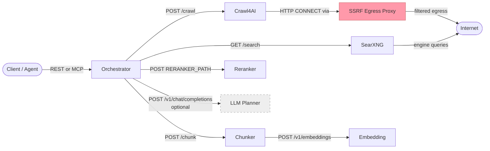

# Dependencies

## 1. Service Dependency Graph

Dashed border = optional component (not started unless `LLM_ENDPOINT` is configured or the models profile activates it).

## 2. Docker Image Inventory

| Image | Pinned Tag / SHA | Architecture | License | Purpose |
|---|---|---|---|---|
| `ghcr.io/feanorscodesl/thorondor-orchestrator` | release tag or digest | amd64, arm64 | MIT | First-party REST/MCP orchestration service |
| `ghcr.io/feanorscodesl/thorondor-chunker` | release tag or digest | amd64, arm64 | MIT | First-party semantic chunking service |
| `ghcr.io/feanorscodesl/thorondor-egress-proxy` | release tag or digest | amd64, arm64 | MIT | First-party SSRF-filtering egress proxy |
| `searxng/searxng` | `@sha256:02d441bbb647b7be422d21041420115cddadac4644368f67c7c7f407bbe72e22` | amd64, arm64 | AGPL-3.0 | Multi-engine URL discovery |
| `unclecode/crawl4ai` | `@sha256:b243f684ad20f71ee108ab3fc3f31f3349eb5b31a9947b9e563d868417141aad` | amd64 | Apache-2.0 | JavaScript-capable page crawling |
| `ghcr.io/huggingface/text-embeddings-inference` | `@sha256:b3e0169969c0dc4b22ab6bf6ad5699374d4cb720fc43fb66868a679586ea806f` | amd64, arm64 | Apache-2.0 | Embedding + reranking (`bundled-models` profile) |
| `ghcr.io/ggml-org/llama.cpp:server` | `@sha256:4c52f549b6612fc1b4aee696c4cfb4a9dceecb10216bb7e677cf97db909e1b4a` | amd64, arm64 | MIT | Embedding + reranking via GGUF (`llamacpp-models` profile) |
| `python:3.13-slim` | tag-pinned official image | amd64, arm64 | PSF License | Base for first-party Python services |

> Note: first-party service Dockerfiles run as non-root users. The Python base image remains an official version tag so maintainers can receive routine patch updates; production distributors who need byte-for-byte reproducibility should pin that base image to a vetted digest in their downstream build.

The `publish-images` workflow is the source of the first-party GHCR images. It
publishes multi-arch manifests and records digest refs in the release artifact
`THORONDOR_IMAGE_DIGESTS.md`.

## 3. Python Package Inventory

### Orchestrator (`orchestrator/requirements.txt`)

| Package | Version | License | Purpose |
|---|---|---|---|
| FastAPI | 0.136.3 | MIT | REST API framework |
| Uvicorn[standard] | 0.49.0 | BSD-3-Clause | ASGI server |
| httpx | 0.28.1 | BSD-3-Clause | Async HTTP client for all downstream seams |
| Pydantic | 2.13.4 | MIT | Request/response wire models, settings validation |
| MCP Python SDK | 1.27.2 | MIT | MCP `web_search` tool surface |
| Trafilatura | 2.1.0 | Apache-2.0 | HTML-to-Markdown content extraction |

### Semantic Chunking Service (`semantic-chunking-service/requirements.txt`)

| Package | Version | License | Purpose |
|---|---|---|---|
| FastAPI | 0.136.3 | MIT | REST API framework |
| Uvicorn[standard] | 0.49.0 | BSD-3-Clause | ASGI server |
| httpx | 0.28.1 | BSD-3-Clause | HTTP client for embedding server calls |
| NumPy | 2.4.6 | BSD-3-Clause | Similarity matrix computation, cosine similarity |
| Pydantic | 2.13.4 | MIT | Request/response models |

### Dev / Test dependencies

| Package | File | Purpose |
|---|---|---|
| pytest + plugins | `orchestrator/requirements-dev.txt` | Test runner |
| pytest + plugins | `semantic-chunking-service/requirements-dev.txt` | Test runner |

The source distribution lists direct dependencies. CI installs the direct runtime and dev requirements from both services before running the offline pytest suite. Binary or container distributors should generate a transitive SBOM for the exact artifact they publish.

## 4. Model Artifacts

The `llamacpp-models` profile requires two GGUF files under `<project>/models/`. The TUI and the `thorondor download-models` subcommand download them automatically from the default Q8 sources below on first run. Operators who prefer manual placement can `curl` (or `huggingface-cli download`) the same URLs and drop the files into `models/`; the auto-downloader only fetches what's missing and refuses to overwrite existing non-empty files.

| Model file | Format | Purpose | License | Default source |
|---|---|---|---|---|
| `bge-m3.gguf` | GGUF (GGML), Q8 | Text embeddings (1024-dim, multilingual) | MIT (BAAI/bge-m3) | `https://huggingface.co/BAAI/bge-m3-GGUF/resolve/main/bge-m3-q8_0.gguf` |
| `bge-reranker-v2-m3.gguf` | GGUF (GGML), Q8 | Cross-encoder passage reranking | Apache-2.0 (BAAI/bge-reranker-v2-m3) | `https://huggingface.co/BAAI/bge-reranker-v2-m3-GGUF/resolve/main/bge-reranker-v2-m3-q8_0.gguf` |

Approximate sizes: `bge-m3.gguf` is ~570 MB in Q8 quantization; `bge-reranker-v2-m3.gguf` is ~570 MB in Q8 quantization. Actual sizes depend on quantization level.

> Always verify current model license terms on HuggingFace Hub before downloading weights into a production environment.

The default sources live in `thorondor_cli/models.py` (`LLAMACPP_MODEL_SOURCES`). To swap in a different quantization or mirror, edit that table and re-run `thorondor download-models` (or pick the mode in the TUI). The filenames (`bge-m3.gguf`, `bge-reranker-v2-m3.gguf`) and the `LLAMACPP_EMBEDDING_MODEL` / `LLAMACPP_RERANKER_MODEL` container paths in `.env.llamacpp` must stay in sync.

When using the `bundled-models` (TEI) profile, model weights are downloaded from HuggingFace Hub inside the container on first start. The same model IDs apply: `BAAI/bge-m3` for embeddings and `BAAI/bge-reranker-v2-m3` for reranking.

## 5. External Runtime Calls

| Destination | When called | Optional | Data sent |
|---|---|---|---|
| SearXNG (`SEARXNG_URL`) | Every search, for each sub-query | No (hard dependency) | Sub-query text, optional time_range, X-Request-ID, X-Real-IP header |
| Crawl4AI (`CRAWL4AI_URL`) | Every search, for each selected URL | Degrades (no pages if unavailable) | URL, crawler config (robots.txt flag), X-Request-ID |
| Chunking service (`CHUNKER_URL`) | Every search, for each crawled page | No (hard dependency) | Page markdown, source URL, title, source_id |
| Embedding server (`EMBEDDING_ENDPOINT`) | Every chunk request with ≥1 segment | Degrades (token-based fallback) | Segment texts, model name |
| Reranker (`RERANKER_ENDPOINT`) | Every search after chunking | Degrades (position ordering if unavailable) | Query text, chunk texts (in batches), model name |
| LLM planner (`LLM_ENDPOINT`) | Every search if configured and `decompose=true` | Yes (IdentityPlanner fallback) | Original query, system prompt |
| SearXNG upstream search engines | Via SearXNG, not directly by Thorondor | Depends on SearXNG config | User query (after SearXNG's routing logic) |
| Crawl target sites | Via Crawl4AI and the SSRF egress proxy | N/A | HTTP GET to discovered URLs |

## 6. Dev / CI Tooling

| Tool | Config | Purpose |
|---|---|---|
| pytest | `orchestrator/tests/`, `semantic-chunking-service/tests/` | Unit and integration tests |
| PowerShell 7+ | `scripts/*.ps1` | Deploy, smoke, and release-guard scripts |
| Bash | `scripts/*.sh` | Linux equivalents of the PowerShell scripts |
| Docker Compose | `docker-compose.yml`, `docker-compose.llamacpp.yml` | Local stack management |
| GitHub Actions | `.github/workflows/release-guard.yml` | CI release guard, dependency install, compile check, offline pytest, and Compose config validation |
