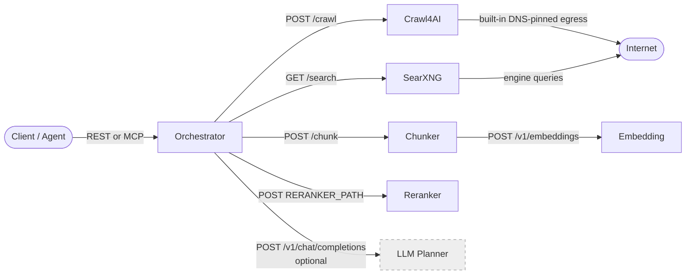

# Dependencies

## 1. Service Dependency Graph

Dashed border = optional component (not started unless `LLM_ENDPOINT` is configured or the models profile activates it).

## 2. Docker Image Inventory

| Image | Pinned Tag / SHA | Architecture | License | Purpose |
|---|---|---|---|---|
| `ghcr.io/feanorscodesl/thorondor-orchestrator` | release tag or digest | amd64, arm64 | MIT | First-party REST/MCP orchestration service |
| `ghcr.io/feanorscodesl/thorondor-chunker` | release tag or digest | amd64, arm64 | MIT | First-party semantic chunking service |
| `ghcr.io/feanorscodesl/thorondor-egress-proxy` | release tag or digest | amd64, arm64 | MIT | Retained first-party SSRF proxy; Crawl4AI 0.9.2 does not route through it |
| `searxng/searxng` | `2026.8.4-c63835bd2`, `@sha256:f4c8e59de166ed71f6380c0847c312ca51f0d41996e31d0559163b6b09ecde52` | amd64, arm64, arm/v7 | AGPL-3.0 | Multi-engine URL discovery |
| `unclecode/crawl4ai` | `0.9.2`, `@sha256:bd36741e7bdd35ddc1a05d9183e1d6d8cefb61dd640d944a25d026b76e917690` | amd64, arm64 | Apache-2.0 | JavaScript-capable page crawling with connect-time DNS pinning |
| `ghcr.io/huggingface/text-embeddings-inference` | revision `4150561`, `@sha256:af92a3852c965393cbdd111865c3a72445d2b430c7daf84269ffdb5cf178f4eb` | amd64 only | Apache-2.0 | Embedding + reranking (`bundled-models` profile) |
| `ghcr.io/ggml-org/llama.cpp:server` | build `b10276`, `@sha256:bde659bfc300ee7d4d2e558e8a97e06211bc2bf079e31d22b61497f4f2cd85b1` | amd64, arm64, s390x | MIT | Embedding + reranking via GGUF (`llamacpp-models` profile) |
| `python:3.13-slim` | `@sha256:bf503bb2243c5aad0aa951544dd60d165f992646441d35dea90893703fc26251` | amd64, arm64 | PSF License | Base for first-party Python services |

> Note: first-party service Dockerfiles run as non-root users. The Python base image is pinned to the vetted multi-architecture `3.13.14-slim-trixie` manifest digest.

The `publish-images` workflow is the source of the first-party GHCR images. It
publishes multi-arch manifests and records digest refs in the release artifact
`THORONDOR_IMAGE_DIGESTS.md`.

## 3. Python Package Inventory

### Orchestrator (`orchestrator/requirements.txt`)

| Package | Version | License | Purpose |
|---|---|---|---|
| FastAPI | 0.141.1 | MIT | REST API framework |
| Uvicorn[standard] | 0.52.1 | BSD-3-Clause | ASGI server |
| httpx | 0.28.1 | BSD-3-Clause | Async HTTP client for all downstream seams |
| idna | 3.18 | BSD-3-Clause | Non-transitional IDNA encoding for conservative URL identity |
| Pydantic | 2.13.4 | MIT | Request/response wire models, settings validation |
| MCP Python SDK | 2.0.0 | MIT | MCP `web_search`, `web_fetch`, `web_map`, and `web_crawl` tool surfaces |
| Trafilatura | 2.2.0 | Apache-2.0 | HTML-to-Markdown content extraction |

Page-cache and crawl-job persistence use Python's standard-library `sqlite3`; the
current design adds no runtime package, Redis service, or queue dependency.

### Semantic Chunking Service (`semantic-chunking-service/requirements.txt`)

| Package | Version | License | Purpose |
|---|---|---|---|
| FastAPI | 0.141.1 | MIT | REST API framework |
| Uvicorn[standard] | 0.52.1 | BSD-3-Clause | ASGI server |
| httpx | 0.28.1 | BSD-3-Clause | HTTP client for embedding server calls |
| NumPy | 2.5.1 | BSD-3-Clause | Similarity matrix computation, cosine similarity |
| Pydantic | 2.13.4 | MIT | Request/response models |

### Dev / Test dependencies

| Package | File | Purpose |
|---|---|---|
| pytest + plugins | `orchestrator/requirements-dev.lock` | Locked test environment |
| pytest + plugins | `semantic-chunking-service/requirements-dev.lock` | Locked test environment |

The `.txt` files declare direct dependencies. The runtime and development `.lock` files pin complete transitive environments; Docker and CI install those locks. Binary or container distributors should still generate a transitive SBOM for the exact artifact they publish.

## 4. Model Artifacts

The `llamacpp-models` profile requires two GGUF files under `<project>/models/`. The TUI and the `thorondor download-models` subcommand download them automatically from the immutable Q8 sources below and verify SHA-256 before installation. Existing non-empty files are never overwritten; the subcommand verifies known default files and reports a mismatch.

| Model file | Format | Purpose | License | Source revision | SHA-256 |
|---|---|---|---|---|---|
| `bge-m3.gguf` | GGUF, Q8_0 | Text embeddings (1024-dim, multilingual) | MIT (BAAI/bge-m3) | `gpustack/bge-m3-GGUF@2d48f1737679ad900d5c26c5aad5410e9c70fdca` | `950f4a8e5e19477a6d3c26d2f162233c20002c601f75e4b002e3239997821167` |
| `bge-reranker-v2-m3.gguf` | GGUF, Q8_0 | Cross-encoder passage reranking | Apache-2.0 (BAAI/bge-reranker-v2-m3) | `gpustack/bge-reranker-v2-m3-GGUF@3093af03b1a635e67b084b1d8c03c5f5e020fd05` | `a43c7c9b11a4c1517e5bf95151960e1621d1b72f7a493364b01e386cf1aaa1d3` |

The pinned files are 634,553,760 and 635,676,416 bytes respectively.

> Always verify current model license terms on HuggingFace Hub before downloading weights into a production environment.

The default sources and hashes live in `thorondor_cli/models.py`. To use a different quantization or mirror, update its source and checksum together. The filenames (`bge-m3.gguf`, `bge-reranker-v2-m3.gguf`) and the `LLAMACPP_EMBEDDING_MODEL` / `LLAMACPP_RERANKER_MODEL` container paths in `.env.llamacpp` must stay in sync.

When using the `bundled-models` (TEI) profile, model weights are downloaded from Hugging Face Hub inside the container on first start. Compose passes `BAAI/bge-m3@5617a9f61b028005a4858fdac845db406aefb181` for embeddings and `BAAI/bge-reranker-v2-m3@953dc6f6f85a1b2dbfca4c34a2796e7dde08d41e` for reranking.

## 5. External Runtime Calls

| Destination | When called | Optional | Data sent |
|---|---|---|---|
| SearXNG (`SEARXNG_URL`) | Every search, for each sub-query; optionally once for map/crawl augmentation | No for search; optional for map/crawl | Sub-query or bounded `site:` text, optional time_range, X-Request-ID, X-Real-IP header |
| Crawl4AI (`CRAWL4AI_URL`) | Search/fetch page extraction and every map/crawl seed, robots, sitemap, or admitted page fetch | Degrades or terminates the affected operation | URL, crawler/browser config (robots.txt flag and stable User-Agent), X-Request-ID |
| Chunking service (`CHUNKER_URL`) | Every search, for each crawled page | No (hard dependency) | Page markdown, source URL, title, source_id |
| Embedding server (`EMBEDDING_ENDPOINT`) | Every chunk request with ≥1 segment | Degrades (token-based fallback) | Segment texts, model name |
| Reranker (`RERANKER_ENDPOINT`) | Every search after chunking | Degrades (position ordering if unavailable) | Query text, chunk texts (in batches), model name |
| LLM (`LLM_ENDPOINT`) | Search when `decompose=true`; fetch/crawl only for explicit `json_schema` | Yes (IdentityPlanner fallback; schema profile unsupported) | Original query or bounded cleaned Markdown, fixed system prompt, caller schema |
| SearXNG upstream search engines | Via SearXNG, not directly by Thorondor | Depends on SearXNG config | User query (after SearXNG's routing logic) |
| Crawl target sites | Via Crawl4AI's dedicated egress network and built-in DNS-pinning proxy | N/A | HTTP GET to discovered URLs |

## 6. Dev / CI Tooling

| Tool | Config | Purpose |
|---|---|---|
| pytest | `orchestrator/tests/`, `semantic-chunking-service/tests/` | Unit and integration tests |
| PowerShell 7+ | `scripts/*.ps1` | Deploy, smoke, and release-guard scripts |
| Bash | `scripts/*.sh` | Linux equivalents of the PowerShell scripts |
| Docker Compose | `docker-compose.yml`, `docker-compose.llamacpp.yml` | Local stack management |
| GitHub Actions | `.github/workflows/release-guard.yml` | CI release guard, dependency install, compile check, offline pytest, and Compose config validation |
