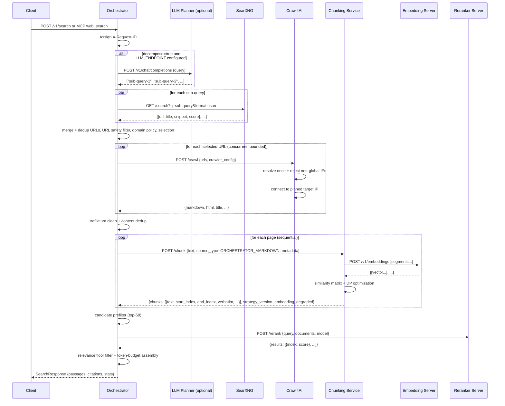
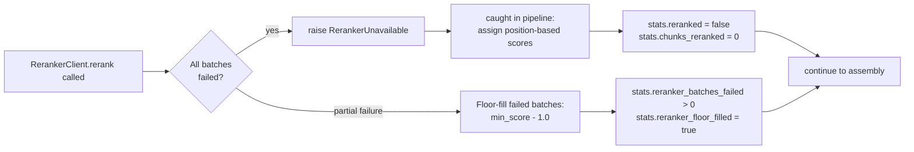
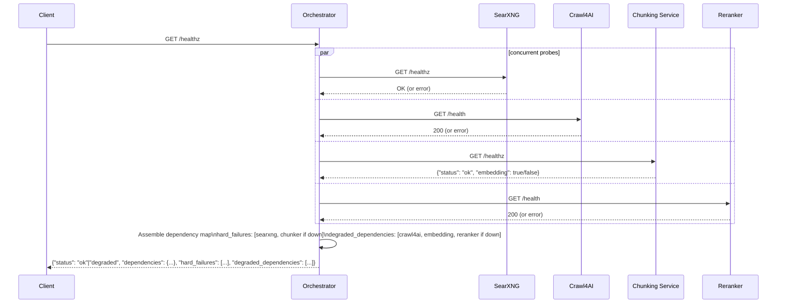
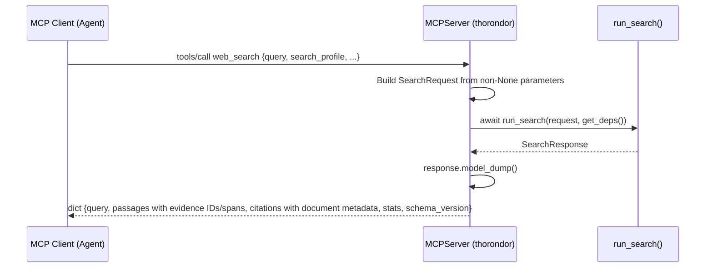

# Pipeline Workflow

## 1. Top-Level Request Flow

The following diagram shows the complete path of a single search request from client to response across all services.



### Known-URL fetch path

`POST /v1/fetch` and MCP `web_fetch` skip discovery, chunking, embedding, and reranking. They validate one to four URLs and always rerun URL safety and current robots policy before consulting the optional page cache. Cache identity preserves host and query distinctions and includes retrieval capabilities plus cleaner version. Credential-bearing URLs, raw HTML without operator opt-in, PDFs, and documents bypass persistence; the fetch contract does not accept caller-supplied headers or cookies.

A fresh record is returned directly. An expired record is refreshed synchronously unless a non-watch request opts into the bounded stale window. Concurrent refreshes for one key coalesce. `force_refresh` always requests a current comparison. The production browser route performs a full Crawl4AI refetch and compares cleaned-content hash plus HTTP status; a separately capable extractor may send validators and reuse the stored record after a `304`. Challenge shells, robots refusals, and fetch failures never replace a valid record; `404` and `410` are retained as bounded tombstones so removal transitions remain observable.

Target watches parse the raw fetched DOM when available without executing caller code, resolve exactly one declared element, project only its normalized text and requested condition attribute, and compare that snapshot independently from the whole-page hash. History is keyed by the complete watch definition, and an unresolved observation retains the last valid comparison baseline while exposing the current failure. The condition becomes true only on an expected-to-desired transition. Diffs normalize line endings and stop before configured input or comparison-work caps. Request, response, content, and route-deadline limits remain shared across REST and MCP; foreground timeout or caller cancellation cancels pending work, while explicitly requested stale refreshes reacquire admission, run under the fetch deadline, and are cancelled during process shutdown.

### Site map and crawl path

`POST /v1/map` / MCP `web_map` and `POST /v1/crawl` / MCP `web_crawl` share `run_map`, `run_crawl`, and one crawl-frontier policy. The seed is URL-safety checked and fetched through Crawl4AI before scope is re-homed to its validated effective origin. Thorondor then obtains an origin robots snapshot, processes declared and common sitemaps within byte, entry, document, and nesting bounds, optionally adds SearXNG `site:` candidates, and traverses links breadth-first unless `sitemap=only`.

Every candidate passes deterministic URL normalization, same-origin and seed-directory scope, include/exclude globs, query and file policy, URL safety, robots, deduplication, depth, discovery, and page limits. Requests to one host honor configured spacing, robots crawl delay, bounded jitter, parsed `Retry-After`, and adaptive 403/429 cooldown. `map` returns URL state histories and source diagnostics; `crawl` adds the same typed fetch results as known-URL fetch. The route deadline and caller cancellation cancel pending traversal rather than leaving background work running.

### Durable crawl-job path

`POST /v1/crawl/jobs` atomically claims the caller's scoped idempotency key and canonical request fingerprint, then one process-owned worker invokes the same `run_crawl_job` frontier, safety, robots, politeness, admission, and deadline path. Results are written transactionally as each page completes, so status and cursor pagination can expose bounded partial progress without waiting for the terminal response. The store deduplicates by conservative final-URL identity and reconciles requested-URL failures after a successful redirect retry.

Startup changes interrupted `running` jobs back to `queued` unless their attempt budget is exhausted; a persisted cancellation becomes terminal instead of being resumed. Recovery repeats the bounded crawl from its seed and relies on atomic final-URL result deduplication rather than persisting the frontier. Retryable job-level capacity and deadline failures, plus zero-success terminal upstream failures, use bounded exponential backoff; completed or partial responses are not retried because one transient page must not amplify the whole crawl. Cancellation sets a durable request flag and an in-process event, stops new URL admission, and allows only already-started I/O to finish under the job-attempt deadline. `completed`, `partial`, `failed`, and `cancelled` results expire at an absolute terminal deadline; polling does not extend it.

## 2. Orchestrator Internal State Machine

This diagram shows the sequential stages inside `run_search` in `orchestrator/pipeline.py`, including the early-exit branches that produce empty 200 responses.

```mermaid
flowchart TD
    A[Receive SearchRequest] --> B[Resolve profile defaults\ntoken_budget / max_urls / max_passages]
    B --> C{LLM planner\nconfigured?}
    C -- yes --> D[LlmPlanner.plan → sub-queries]
    C -- no --> E[IdentityPlanner → original query]
    D --> F[SearXNG concurrent discovery]
    E --> F

    F -- DiscoveryUnavailable --> FAIL503[503 SearchDependencyUnavailable\ndependency=searxng]
    F --> G[merge_dedup results\ncapture unresponsive_engines]
    G --> H{urls_discovered == 0?}
    H -- yes, engine failures --> EMPTY0[200 empty\ndiscovery_status=unavailable\nreason=search_provider_unavailable]
    H -- yes, no failures --> EMPTY1[200 empty\ndiscovery_status=ok\nreason=no_results_from_discovery]
    H -- no, engine failures --> DEG[discovery_status=degraded]
    H -- no failures --> I[URL safety filter]
    DEG --> I

    I --> J[Domain blocklist + allowlist]
    J --> K[SelectionPolicyImpl\nengine diversity → domain diversity → score]
    K --> L{urls_selected == 0?}
    L -- yes --> EMPTY2[200 empty\nreason=no_urls_after_selection]
    L -- no --> M[Crawl4aiExtractor.extract\nconcurrent, per-host bounded]

    M --> N{urls_crawled_ok == 0?}
    N -- yes --> EMPTY3[200 empty\nreason=all_crawls_failed]
    N -- no --> O[MarkdownCleanerImpl\ntrafilatura per page]

    O --> P[content_dedup\nremove full-document exact duplicates]
    P --> Q[ChunkerClient.chunk\nPOST /chunk per page]
    Q -- ChunkerUnavailable --> FAIL503B[503 SearchDependencyUnavailable\ndependency=chunker]
    Q --> R{chunks_produced == 0?}
    R -- yes --> EMPTY4[200 empty\nreason=no_chunks_after_dedup]
    R -- no --> S[CandidatePrefilterImpl\nlexical top-50, source-preserving]

    S --> T[RerankerClient.rerank\nbatched POST /rerank]
    T -- RerankerUnavailable --> U[Degrade: position-based scores\nstats.reranked = false]
    T -- success --> V[stats.reranked = true]

    U --> W{scored == empty?}
    V --> W
    W -- yes --> EMPTY5[200 empty\nreason=no_chunks_after_rerank]
    W -- no --> X[relevance floor filter\nif RELEVANCE_SCORE_FLOOR > 0]

    X --> X2{EVIDENCE_QUALITY_ENABLED?}
    X2 -- yes --> X3[evidence-quality@1\nnoise rejection]
    X3 -- empty --> EMPTY6[200 empty\nreason=no_evidence_after_quality_gate]
    X2 -- no --> X4[serialized evidence envelope]
    X3 -- retained --> X4
    X4 -- empty --> EMPTY7[200 empty\nreason=no_evidence_after_output_budget]
    X4 -- retained --> Y[ResultAssemblerImpl\ntoken budget greedy fill\nmax_passages cap]
    Y --> Z[Build SearchResponse\npassages + citations + stats]
    Z --> LOG[emit search_completed log]
    LOG --> RESP[Return SearchResponse]
```

## 3. Degraded-Mode Branches

### Search engines degraded

SearXNG returns engine failures and suspension reasons in `unresponsive_engines` even when the HTTP response is 200. The orchestrator preserves these entries in `stats.unresponsive_engines`. If other engines still provide usable results, the pipeline continues with `stats.discovery_status=degraded`. If reported engine failures leave no usable results, the response is an empty 200 with `stats.discovery_status=unavailable` and `stats.reason=search_provider_unavailable`. An empty result with no reported engine failures remains a healthy empty search with `stats.discovery_status=ok` and `stats.reason=no_results_from_discovery`.

### Reranker unavailable

Every reranker invocation returns request-owned scores and telemetry together. When every batch fails, `RerankerClient.rerank` raises `RerankerUnavailable` carrying that request's counters. The pipeline assigns scores by position (score = 1/(index+1)) and sets `stats.reranked=false`. The scalar score remains the ordering contract, while `score_components` labels the actual versioned reranker, partial-floor, or fallback calculation.



### Embedding unavailable (chunker degraded)

When the embedding server is unreachable, the chunker's `ClusterSemanticChunker` catches the exception and falls back to token-based greedy splitting. Chunks are returned with `embedding_degraded=true`. The orchestrator pipeline continues normally; `stats.embedding_degraded=true` in the response indicates semantic chunking was not used.

```mermaid
flowchart LR
    A[Chunker calls EmbeddingFunction] --> B{Embedding\nserver reachable?}
    B -- no --> C[_fallback_chunking:\ngreedy token-based splits]
    C --> D[chunk_strategy = cluster-semantic-greedy-token\nembedding_degraded = true]
    D --> E[Return chunks to orchestrator]
    E --> F[stats.embedding_degraded = true\nin SearchResponse]

    B -- yes, but segment count too large --> G[_greedy_semantic_chunking:\nadjacent-pair similarities only\nO(N) memory]
    G --> H[chunk_strategy = cluster-semantic-greedy-semantic]
    H --> E
```

### Crawl partially fails

A per-URL crawl failure is silent at the URL level — the URL is skipped and `stats.urls_crawled_failed` is incremented. The pipeline continues with whatever pages were successfully crawled. An empty response is only returned when **all** crawls fail.

## 4. Liveness and Readiness Flow

`GET /livez` verifies only that the orchestrator process can serve requests. It
does not call any dependency and is the endpoint used by the Docker health
check.

`GET /healthz` probes all five dependencies concurrently and assembles a single
readiness response. No dependency probe performs a public search. The SearXNG
probe uses SearXNG's local `/healthz` endpoint, while other probe timeouts are
governed by `HEALTHCHECK_TIMEOUT_S`.



`hard_failures` lists `searxng` or `chunker` — either causes `SearchDependencyUnavailable` (503) during a live search. `degraded_dependencies` lists `crawl4ai`, `embedding`, and `reranker`; their absence degrades quality but does not block the endpoint.

## 5. MCP Tool Invocation Flow

The MCP tools are thin wrappers over the same `run_search`, `run_fetch`, `run_map`, and `run_crawl` pipelines used by their REST endpoints. No separate production pipeline exists between the REST and MCP surfaces, and the native stdio proxy preserves the same request signatures and response JSON.



The MCP server is mounted at `/mcp` using `mcp.streamable_http_app()` with `stateless_http=True`. Stdio transport is available via `python -m orchestrator.mcp_server` for environments that require it.

`X-Request-ID` propagation works identically for MCP calls — the middleware assigns the ID at the HTTP layer before the MCP frame is decoded, and it is forwarded to all downstream seams.
